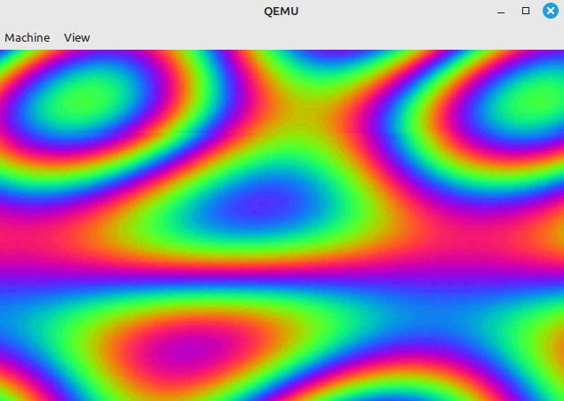

# Boot Sector Plasma Effect

A 512-byte x86 real-mode boot sector program that renders an animated colour plasma
directly in VGA mode 13h (320×200, 256 colours).



## Build & run

```bash
nasm -f bin -o plasma.bin plasma.asm
qemu-system-i386 -L /usr/local/share/qemu plasma.bin

Where: -L is the path to the qemu bios dir

```

## How it works

### Setup
The CPU starts in 16-bit real mode. Segments DS, SS and ES are zeroed so the
full first megabyte is directly addressable. A single BIOS call (`INT 10h`,
`AX=0013h`) switches to mode 13h.

### Colour palette
Mode 13h's 256-colour DAC is loaded with a **3-phase sine rainbow**:

| channel | formula |
|---------|---------|
| R | `sine_table[i]       >> 2` |
| G | `sine_table[(i+85) & 0xFF] >> 2` |
| B | `sine_table[(i+170) & 0xFF] >> 2` |

The three channels are offset by 85 (≈ 120°), so the palette cycles smoothly
through every hue as the colour index increases.

### Sine lookup table
A 256-byte table stores `round(127.5 + 127.5 × sin(i × 2π/256))` — a full
sine wave mapped to the range 0–255. It lives in the boot sector itself, using
the last ~256 bytes before the boot signature at offset 510.

### Plasma formula
Each frame, every pixel at screen position *(x, y)* gets its colour from:

```
colour = sine[x + t]  +  sine[2·y + t]  +  sine[x + y + 2·t]
```

All indices wrap mod 256 automatically via 8-bit register arithmetic.
The three sine waves are phase-shifted and scaled differently, so they
interfere and produce the classic swirling plasma pattern.

`t` is an 8-bit counter held in `DH` and incremented once per frame, causing
the whole pattern to animate continuously.

### Memory layout

```
0x7C00  code (~138 bytes)
0x7C8A  sine_table (256 bytes)
0x7DFE  0x55 0xAA  ← boot signature
```
